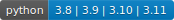

# Neural Network for Digital Twin (NNDT)

[](https://github.com/nndt-team/nndt/issues?q=is%3Aissue+is%3Aopen+label%3A%22good+first+issue%22)
[](https://github.com/nndt-team/nndt)
[](https://codecov.io/gh/nndt-team/nndt)
[](https://www.codefactor.io/repository/github/nndt-team/nndt)
[](actions/workflows/ci-build.yml)
[](https://github.com/nndt-team/nndt/blob/main/LICENSE)
[](https://www.python.org/downloads/release/python-3110/)

[](https://github.com/psf/black)


[Wiki](wiki) | [Change logs](CHANGELOG.md)

This is experimental library for unusual neural network applications. Description and docs will come soon!

## Install
 
The last stable release:
```
pip install git+https://github.com/nndt-team/nndt.git
```

The developer release:
```
pip install git+https://github.com/nndt-team/nndt.git@dev
```

[Installation for Windows with WSL](wiki/NNDT-WSL)

## Test

How to run the tests?
 - Unpack `./test/acdc_for_test.7z`.
 - Configure your IDE to run test from `test` folder and assume `nndt/nndt` as a source root.
 - Run test;)
 
## Tutorials and examples

NOTE! This project is in an early stage. API and examples are changed every day. 
The following notebooks use `v0.0.1rc` branch.

Tutorials
1. [Basics for space models](tutorials/tutorial1_space_model.ipynb)
2. [Data visualization](tutorials/tutorials/tutorial2_research_viz.ipynb)

Tests for manual evaluation
1. [Shape interpolation](tests_manual/sdf_multiple_files.py)
2. [Mesh segmentation (supervised)](tests_manual/mesh_segmentation.py)
3. [Eikonal equation solution (geodesic distance in 3D)](tests_manual/eikonal_on_primitives.py)

